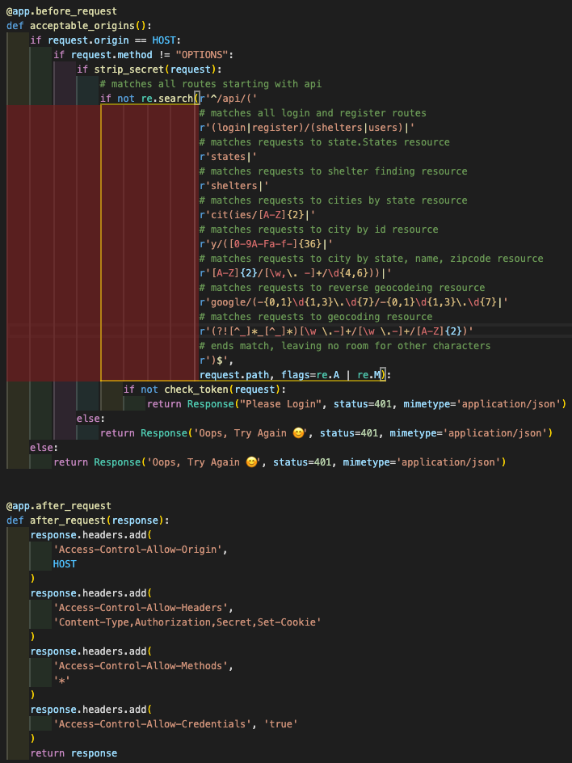

<h1 align='center'>:dog2: Simple Additions :dog:</h1>

## Founded By: Sam'an Griffiths

We are a simple and easy way to find a new family member. We utilize the kaggle animal shelter database to give you a list of animal shelters near you where you might find the newest addition to your family! Each year, approximately 920,000 shelter animals are euthanized. With your help, we can put a dent in that number. Right now, the only thing available to the public is our comprehensive sign in and registration form.

<h2 align="center">:black_heart: My Favorite Section Of Code :computer:</h2>
This Was My first venture into Python. Although we did go over the MOST basic functionalities of this language in during the General Assembly Bootcamp, most of the skills I've implemented were self taught through internet research. My favorite section of code is no differentm I tought mhyself regex a couple of weeks ago and decided to implement it in my route security section. I'm sure that I've, by no standard,created the most secure API. That being said, I'm still proud of what I've done here as it's my first attempt, self-taught, it protects against some simple attacks I launched against it, and I use multiple methods of security (namely, cors and simple if else statements).

<h2 align="center">:pancakes: Tech Stack :pancakes:</h2>

### A Huge Thank You To all Of My Sources!	 :partying_face::tada:
- [Kaggle Shelter Database](https://www.kaggle.com/aaronschlegel/petfinder-animal-shelters-database/version/4)
- [Google Sheets API](https://developers.google.com/sheets/api/quickstart/python)
- [Pallets Projects](https://flask.palletsprojects.com/en/)
- [PyCon UK](https://www.youtube.com/watch?v=gJ7CnUX_7YQ)
- [Random-Dog](https://pypi.org/project/random-dog/)
- [Far In Space](https://www.farinspace.com/tag/sql-dump/)

### :bust_in_silhouette:Personal Links:
- [LinkedIn](https://www.linkedin.com/in/saman-griffiths/)
- [Company Website](https://simple-additions.netlify.app/)
- [Portfolio]()

### 	:bricks:Future Additions:

- [x] Dark Mode
- [x] Animal Listings From Shelters
- [x] User Profiles
- [ ] Map Shelters By Proximity
- [ ] Email Verification
- [ ] Route Mapping
- [ ] Report Posts and Comments
- [ ] Star Reviews

